# CLIENT-SITE-IKEv1-L2TP-OVER-IPSEC

> **Autor:** Randy Nin **| Laboratorio de Redes | GNS3**

Implementación de un servidor VPN Client-to-Site mediante L2TP over IPSec con IKEv1 en Cisco IOS, usando el cliente L2TP/IPsec nativo de Windows 11 (sin software de terceros). A diferencia de los laboratorios Site-to-Site de esta serie, aquí IPSec en modo transporte protege el canal L2TP a nivel de dispositivo (PSK), mientras que PPP con MS-CHAPv2, respaldado por AAA local, autentica al usuario y le asigna una IP dinámica desde un pool.

---

## Contenido del repositorio

```
CLIENT-SITE-IKEv1-L2TP-OVER-IPSEC/
├── IMG/
│   ├── topology.png
│   ├── before-vpn.png
│   ├── windows-vpn-config.png
│   ├── windows-vpn-connect.png
│   ├── windows-vpn-connected.png
│   ├── after-vpn-ping.png
│   ├── wireshark-ikev1.png
│   ├── wireshark-esp.png
│   ├── isakmp-ipsec-sa.png
│   ├── dynamic-map.png
│   ├── vpdn-session-tunnel.png
│   ├── ppp-all.png
│   ├── ip-local-pool.png
│   └── aaa-sessions.png
├── L2TP-IPSec
├── Documentación Tecnica Profesional VPN - Client-to-Site - L2TP over IPSec - IKEv1 (Randy Nin -- 2025-0660).pdf
└── README.md
```

---

## Documentación técnica

**[Documentación Tecnica Profesional VPN - Client-to-Site - L2TP over IPSec - IKEv1 (Randy Nin -- 2025-0660).pdf](Documentación%20Tecnica%20Profesional%20VPN%20-%20Client-to-Site%20-%20%20L2TP%20over%20IPSec%20-%20IKEv1%20(Randy%20Nin%20--%202025-0660).pdf)**

---

## Topología

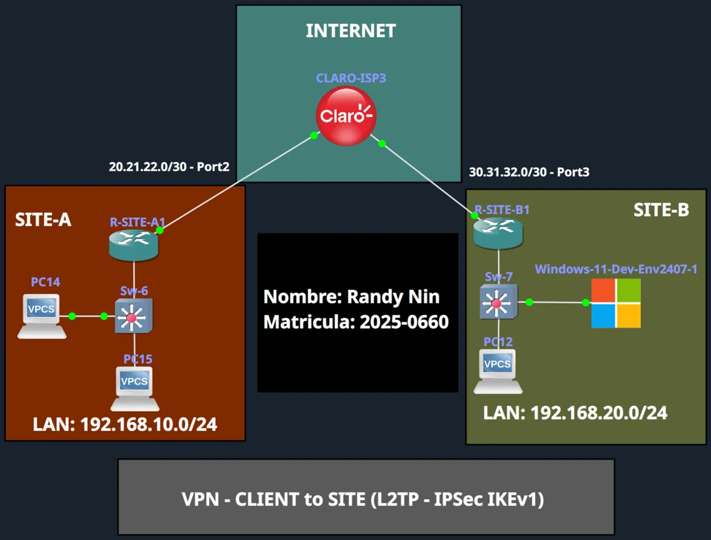

|Dispositivo|Rol|WAN IP|LAN|
|:--|:--|:--|:--|
|R-SITE-A|Servidor L2TP/IPSec (LNS)|20.21.22.1|192.168.10.0/24|
|R-SITE-B|Gateway de salida del cliente|30.31.32.1|192.168.20.0/24|
|Windows-11-Dev-Env2407-1|Cliente L2TP/IPsec|192.168.20.11 (física)|192.168.99.1 (túnel, vía IPCP)|

El cliente Windows está físicamente en la LAN de SITE-B y sale a internet mediante NAT en R-SITE-B, exactamente como cualquier usuario remoto real. SITE-B no tiene ninguna relación de VPN con SITE-A.

---

## Diferencia clave vs Site-to-Site

|Aspecto|Site-to-Site (labs anteriores)|Client-to-Site (este lab)|
|:--|:--|:--|
|Peer|IP fija, `set peer`|Dinámico, `crypto dynamic-map`|
|Autenticación|Solo PSK|PSK + usuario/contraseña (PPP + AAA)|
|Modo IPSec|Tunnel|**Transport** (protege UDP/1701)|
|Direccionamiento remoto|Subred conocida|**IP del pool vía IPCP**|
|Componentes nuevos|Ninguno|**VPDN, Virtual-Template, IP local pool, AAA**|

---

## Configuración del servidor (R-SITE-A)

Archivo completo: [`L2TP-IPSec`](./L2TP-IPSec)

**AAA + IKEv1 compatible con clientes nativos:**

```
aaa new-model
aaa authentication ppp VPN_AUTH local
aaa authorization network VPN_AUTHOR local
username randy password randy0660

crypto isakmp policy 10
 encryption 3des
 hash sha
 authentication pre-share
 group 2
 lifetime 86400

crypto isakmp key randy123 address 0.0.0.0 0.0.0.0
```

**Transform-set transporte + dynamic-map:**

```
crypto ipsec transform-set TRANF_SET esp-3des esp-sha-hmac
 mode transport

crypto dynamic-map L2TP_DMAP 10
 set nat demux
 set transform-set TRANF_SET

crypto map L2TP_MAP 10 ipsec-isakmp dynamic L2TP_DMAP

interface GigabitEthernet0/1
 crypto map L2TP_MAP
```

**VPDN + Virtual-Template + pool:**

```
vpdn enable
vpdn-group L2TP_SERVER
 accept-dialin
  protocol l2tp
  virtual-template 1
 no l2tp tunnel authentication

interface Virtual-Template1
 ip unnumbered GigabitEthernet0/1
 peer default ip address pool VPN_POOL
 ppp authentication ms-chap-v2 VPN_AUTH
 ppp authorization VPN_AUTHOR
 ip nat inside

ip local pool VPN_POOL 192.168.99.1 192.168.99.254
```

---

## Configuración del cliente (Windows 11 nativo)

_Configuración > Red e Internet > VPN > Agregar VPN_

|Campo|Valor|
|:--|:--|
|Server name or address|20.21.22.1|
|VPN type|L2TP/IPsec with pre-shared key|
|Pre-shared key|randy123|
|Username|randy|
|Password|randy0660|

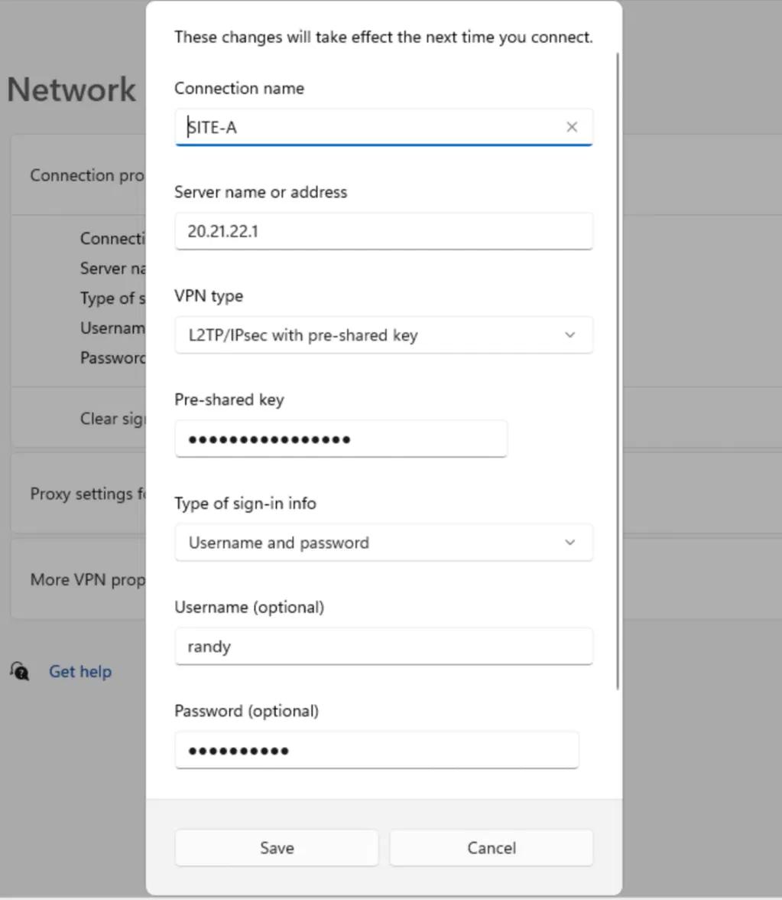

---

## Antes de la VPN: sin conectividad

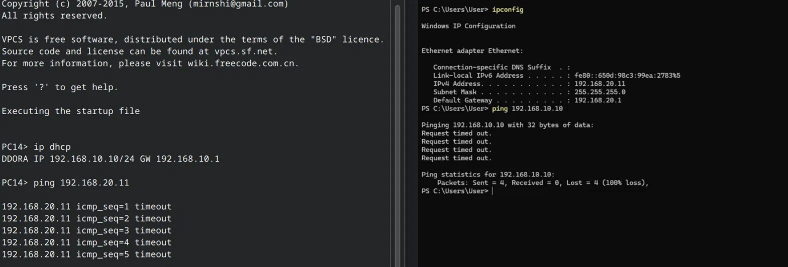

---

## Conectar la VPN

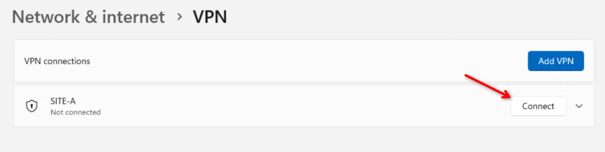 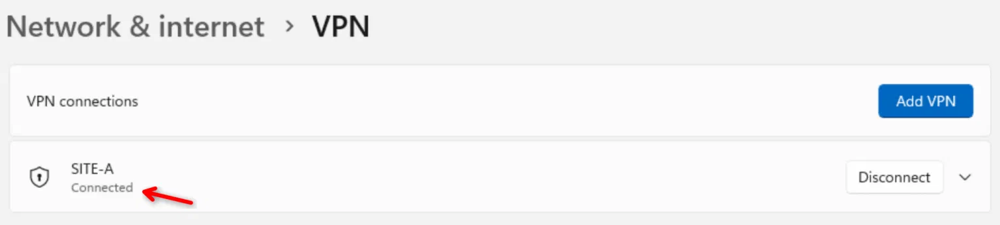

---

## Negociación IKEv1

9 mensajes (6 Main Mode + 3 Quick Mode) entre las IPs públicas de ambos routers, no la del cliente directamente, por el NAT de R-SITE-B.

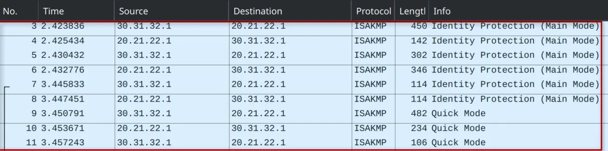

---

## Tráfico ESP cifrado

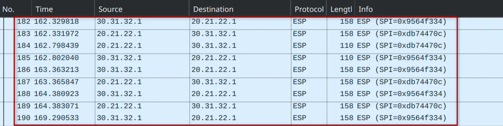

---

## Conectividad establecida

El cliente alcanza la LAN de SITE-A a través del túnel. El camino inverso hacia la IP física del cliente sigue sin funcionar, ya que nunca formó parte de esta VPN.

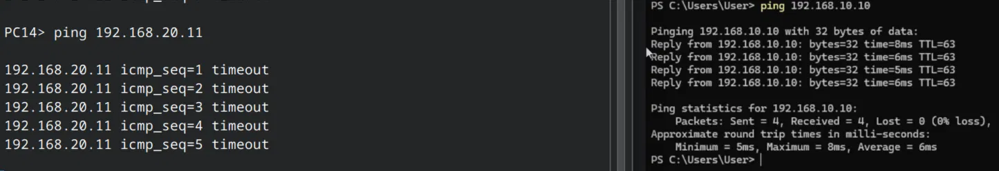

---

## Verificación

### IPSec

Selectores UDP/1701 (L2TP) y puerto NAT-T 4500, confirmando que el tráfico atraviesa el NAT de R-SITE-B.

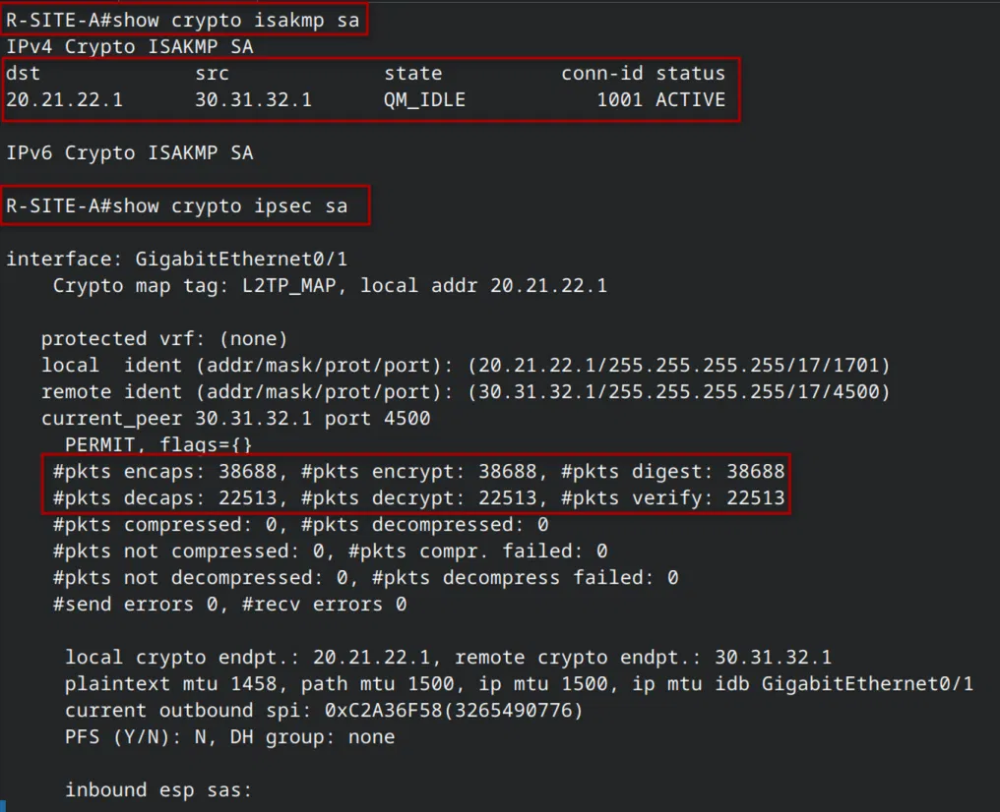 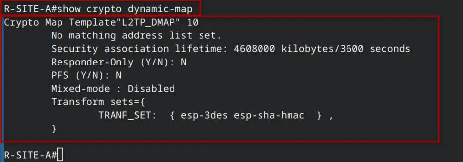

### VPDN y L2TP

Usuario `randy` en sesión `est` sobre `Vi2.1`. Nombre remoto `WinDev2407Eval` (hostname de la VM de evaluación de Windows 11).

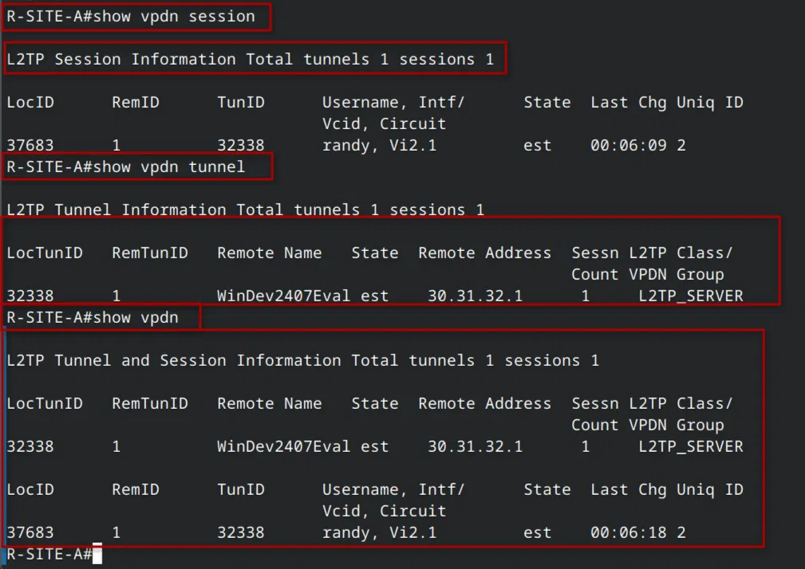

### PPP

Las tres fases (LCP, MS-CHAPv2, IPCP) en estado Open (`+`).

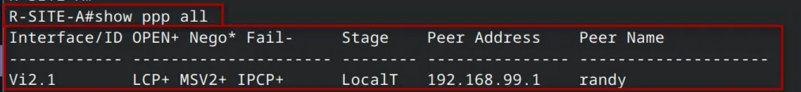

### Pool de IPs

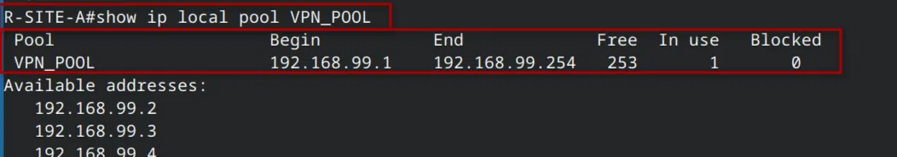

### AAA

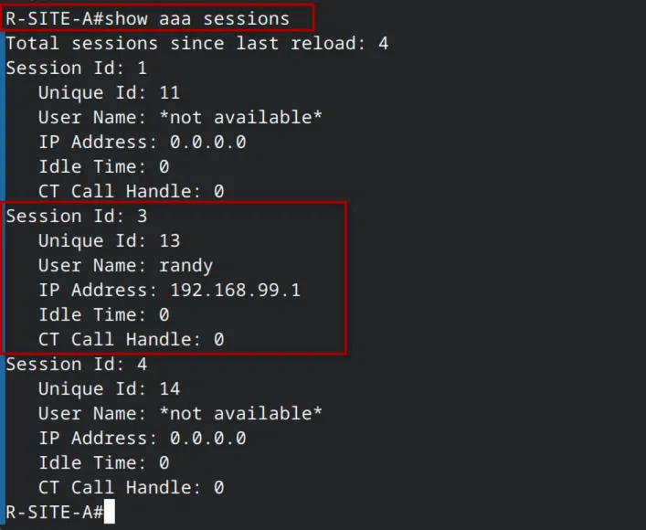

---

## Video demostrativo

**LINK:** [https://youtu.be/u4j0hDXLXOg](https://youtu.be/u4j0hDXLXOg)

---

_Randy Nin / Matrícula 2025-0660_

---

